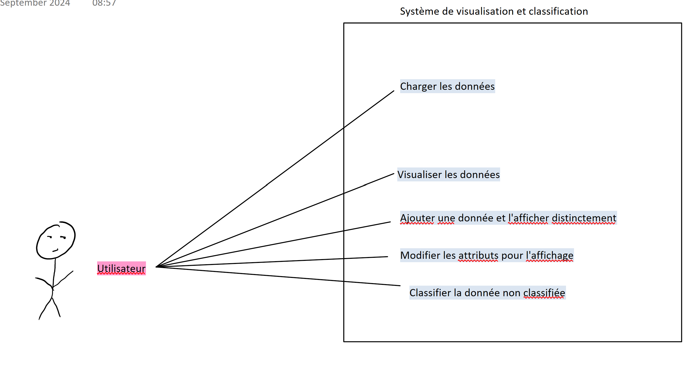
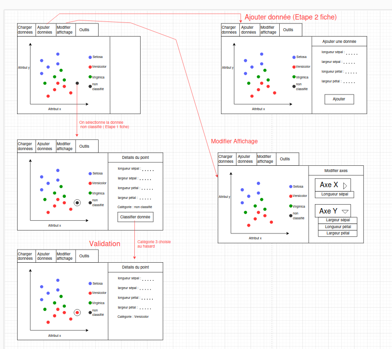
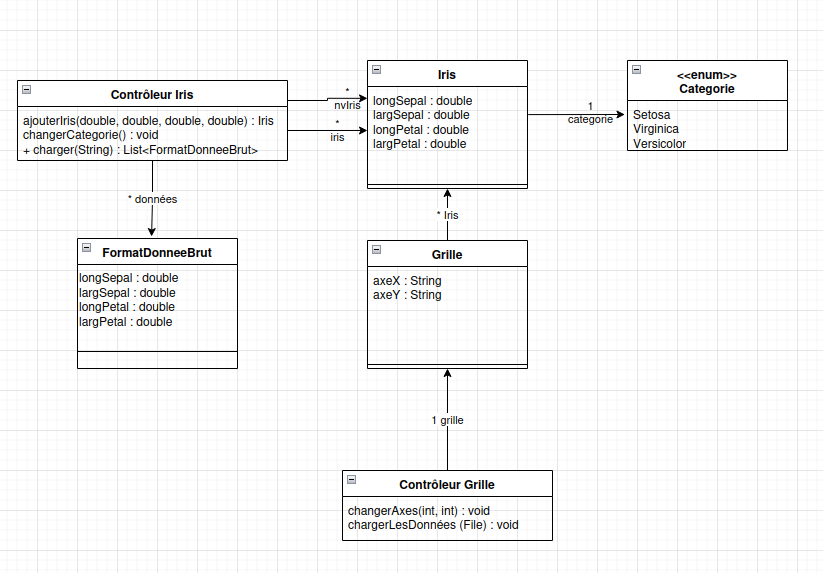

# Dev. Application-Classification

Développé par **Yvan Serikoff**, **Milan Theron**, **Gabriel Mille**, **Léo Gengembre**  
Emails : [yvan.serikoff.etu@univ-lille.fr](mailto:yvan.serikoff.etu@univ-lille.fr), [milan.theron.etu@univ-lille.fr](mailto:milan.theron.etu@univ-lille.fr), [gabriel.mille.etu@univ-lille.fr](mailto:gabriel.mille.etu@univ-lille.fr), [leo.gengembre.etu@univ-lille.fr](mailto:leo.gengembre.etu@univ-lille.fr)

### Équipe
- **Nom de l'équipe** : H1
- **Membres de l'équipe** : Yvan Serikoff, Milan Theron, Gabriel Mille, Léo Gengembre

###     Organisation du travail

**Contributions des membres :**

- **Yvan Serikoff** : Développement des fonctionnalités principales de l'application.

- **Milan Theron** : Optimisation du code et gestion des données.

- **Gabriel Mille** : Création des diagrammes et des fiches descriptives.

- **Léo Gengembre** : Conception de l'interface utilisateur.

## Diagramme de cas d'utilisation

### Fiches descriptives

[Fiches Descriptives](res/img/Fiches.pdf)

### Prototypes pour l'interface

## Diagramme de classes

